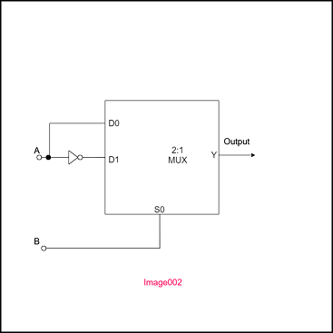

## Post test
<pre> 
1) A 2:1 Multiplexer is connected as shown in figure image002. What output Boolean expression is implemented by the circuit?

a.	Y = A.B
b.	Y = A + B
<b>c.	Y = A XOR B</b>
d.	Y = A XNOR B

2) Refer to the figure in image002.
If the inputs A and B are set to 00, what is the expected output Y?
<b>a. logic zero</b>
b. logic one

3) Refer to the figure in image002.
If the inputs A and B are set to 01, what is the expected output Y?
a. logic zero
<b>b. logic one</b>

4.) Refer to the figure in image003.
If the inputs A and B are set to 10, what is the expected output Y?
a. logic zero
<b>b. logic one</b>

5) Refer to the figure in image002.
If the inputs A and B are set to 11, what is the expected output Y?
<b>a. logic zero</b>
b. logic one

</pre>