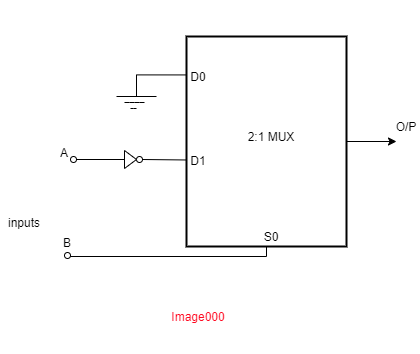

## <b> Pre-test</b>
#### Please attempt the following questions
<pre>
1) 1. Multiplexers can also be referred to as universal circuit builders. State True or False.
<b>a)True.</b>
b)False

2)A 2:1 Multiplexer is connected as shown in figure. What output Boolean expression is implemented by the circuit?

a. Y = A.B
b. Y = A+B
c. Y = A’
<b>d. Y = A’.B</b>

3)Refer to the figure in image000.
If the inputs A and B are set to 00, what is the expected output Y?
<b>a. logic zero</b>
b. logic one

4)Refer to the figure in image000.
If the inputs A and B are set to 11, what is the expected output Y?
<b>a. logic zero</b>
b. logic one

5)Refer to the figure in image000.
If the inputs A and B are set to 01, what is the expected output Y?
a. logic zero
<b>b. logic one</b>
</pre>