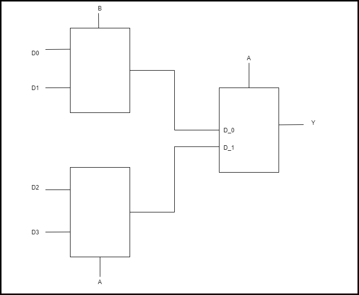
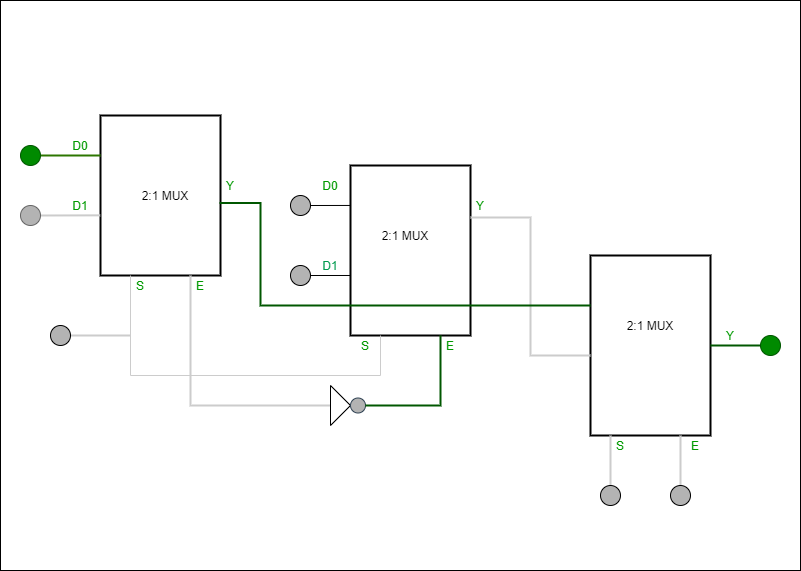
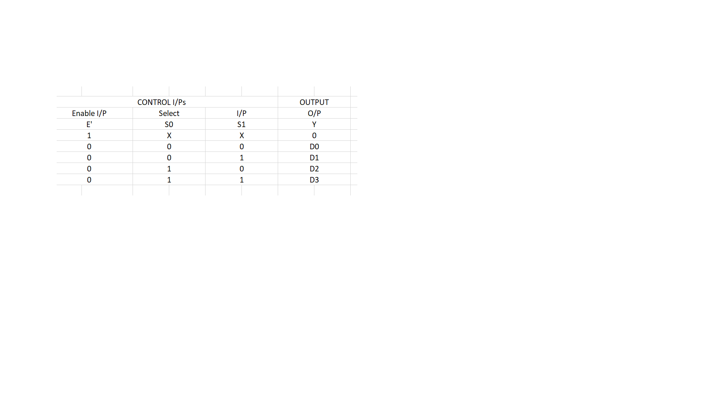

<justify>

**1.1 Introduction**
 
Whenever there is a need to connect multiple input devices, one at a time, to a system, then a digital combinational circuit called multiplexer is useful.
1.2. Example 1: Implementation of 4: 1 Mux
The expression for the output Y in case of a 4:1 multiplexer is given as:

 

Y = A’.B’. D0 + A’. B. D1 + A. B’. D2 + A. B. D3

 

Or 

 

Y = A’.(B’.D0 + B.D1) + A.(B’.D2 + B.D3)

 

Construct the 4:1 mux as shown in figure 
Using simulator the circuit for 4:1 multiplexer can be constructed and verified.

 

 

 

**Assignment:** Realize the equation Y = A’.B + B’.C’ + A.B.C using a 4 -to- 1 multiplexer.

 

**Solution:** 

 

There are three variables in the given equation. Let variables A & B be used as select lines and variable C as the data input D. Express Y as a function of minterms of three variables as shown:

 

Y = A’.B + B’.C’ + A.B.C

 

Y = A’.B + B’.C’(A’ + A) + A.B.C

 

Y = A’.B’.C’ +A’. B. 1 + A. B’. C’ + A.B.C  --- (iv)

 

The logic equation for 4:1 Mux is:

 

Y = A’.B’.D0 + A’.B.D1 + A.B’.D2 + A.B.D3---  (v) 

 

Comparing equations (iv) & (v), 

 

D0 = C’, D1 = 1, D2 = C’ and D3 = C

 

**Connection diagram**:

 

 

**Function Table**:

 

 

Using simulator the circuit can be build and verified.

</justify>