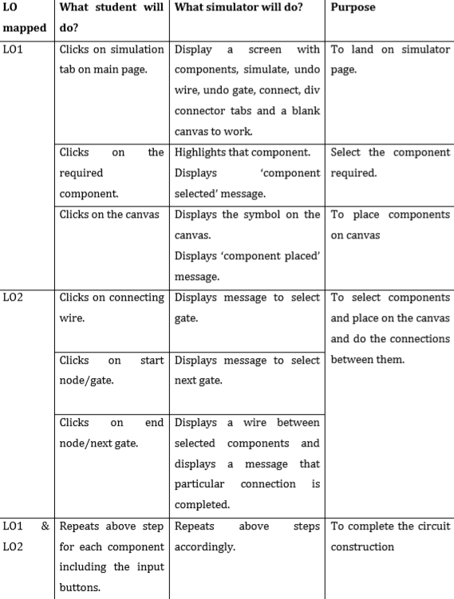
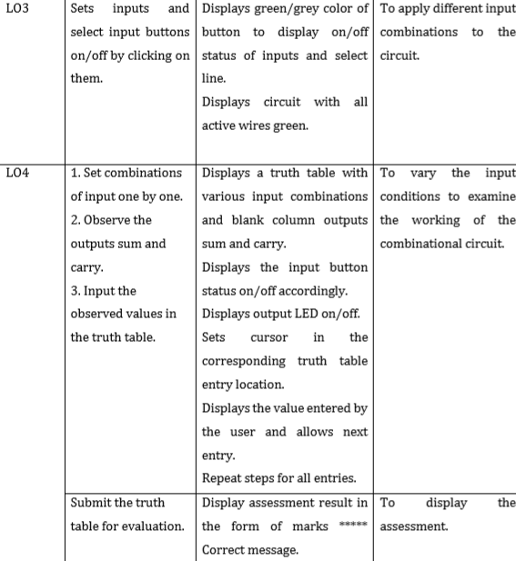

# Round 1 - Pedagogy
**Name of Faculty**: Prof. Mrs Tanuja Sachin Khatavkar  
**Institute**: PVG’s College of Engineering & Technology, Pune-09  
**Email ID**: tanutsk@gmail.com  
**Discipline to which the Lab belongs**: Electronics & Telecommunication  
**Name of the Lab**: Digital Logic Design Using Gates  
**Name of Experiment**: Applications of multiplexers

  Kindly refer these documents before filling the worksheet  

**1. Guidelines :**  
a.  Handout for R1 Overall Summary : http://bit.ly/Vlabs-Dev_Handout_Summary_R1  
b. Handout R1 for topics 1 & 2 : http://bit.ly/Vlabs-Dev_Handout_1_R1  
c. Handout R1 for topics 3 & 4:  http://bit.ly/Vlabs-Dev_Handout2_R1  
d. Presentation  on Learning Objectives: http://bit.ly/Vlabs-Dev_LO-ppt  

**2. Samples of R1 :**

a. Fluid-Mechanics: : http://bit.ly/Fluid-Mech_R1_Sample  
b. Digital-Electronics-Lab:  http://bit.ly/Digital_elec_R1_Sample  
c. Numerical-Methods-Lab:  http://bit.ly/Numerical-Method_R1_Sample  

## 1.1. FOCUS AREA: Experimentation

### 1.2. About the Experiment:
In this experiment the student will learn to design a 4:1 multiplexer using combinations of 2:1 multiplexers and additional gates.

### 1.3 Learning Objectives & Cognitive Levels:
|Sr no. | Learning Objective | Cognitive level |Action Verb |
|-------|--------------------|-----------------|------------|
|1.|	The student will be able to identify the components required for 4:1 multiplexer using 2:1 mux and place them on canvas.|	Apply	| Identify |
|2.|	The student will be able to connect the components and construct a 4:1 multiplexer using multiplexer logic.	| Apply	| Construct |
|3.| The student will be able to change the inputs applied to the 4:1 multiplexer.|	Apply |	Change |
|4.|The students will be able to examine the working of 4:1 multiplexer using mux logic and submit his result for assessment.	| Analyze |	Examine |

## 2.1. Instructional Strategy : Problem based

### 2.2. Assessment Method : Formative Assessment
### 2.3. Description of sections :
The problem statement given in this experiment is to construct a 4:1 multiplexer using multiplexer logic.

### 3. Task & Assessment Questions

|Sr No.| Learning Objective to be met| Tasks to be performed by the students | Assessment questions aligned to the task |
|------|-----------------------------|--------------------------------------------|-------------------------------------|
|1.|	The student will be able to identify the components required for 4:1 multiplexer circuit using 2:1 mux and place them on canvas.	|Student picks and places the required components on the canvas.	|Select the components required and place on canvas.
|2.|The student will be able to connect the components and construct a 4:1 multiplexer using multiplexer logic.	|1.  Clicks on connecting wire.  2. Clicks on start node/gate.  3. Clicks on end node/next gate.  4. Repeats above step for each component|	Make the connections to construct the circuit.
|3.|	The student will be able to change the inputs applied to the 4:1 multiplexer.|	1. Clicks on input button D0, D1, D2 or D3 to set it to 1/0.  2. Clicks on select input buttons (S0,S1) to set them to 1/0.   3.Clicks on Enable to set it to 1/0.	|Change the input conditions for the combinational circuit for circuit verification.
|4.|The students will be able to examine the working of 4:1 multiplexer using mux logic.|	1. Set combinations of input one by one. 2. Observe the output. 3. Input the observed values in the truth table. 4. Submit the truth table for evaluation.|	Examine the circuit outputs sum and carry for various combinations of input and output and fill up the truth table and submit your answers.|

## 4. Simulator Interactions

 

 

  

  
 
 
